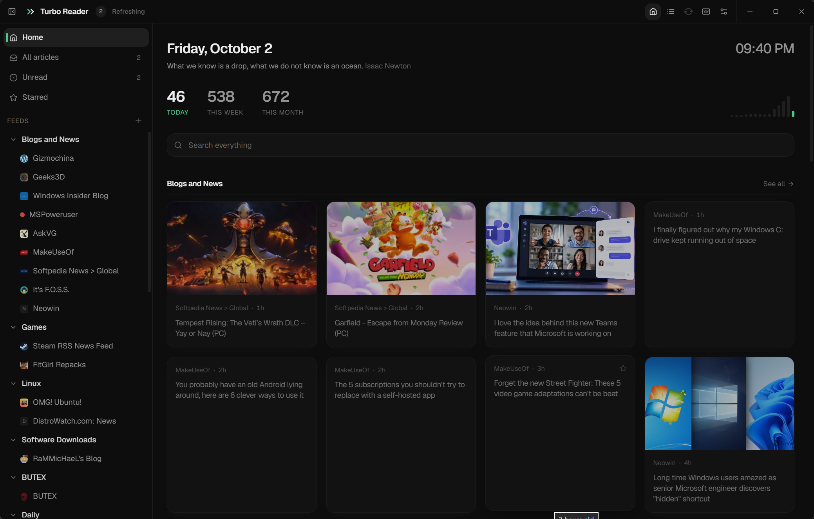
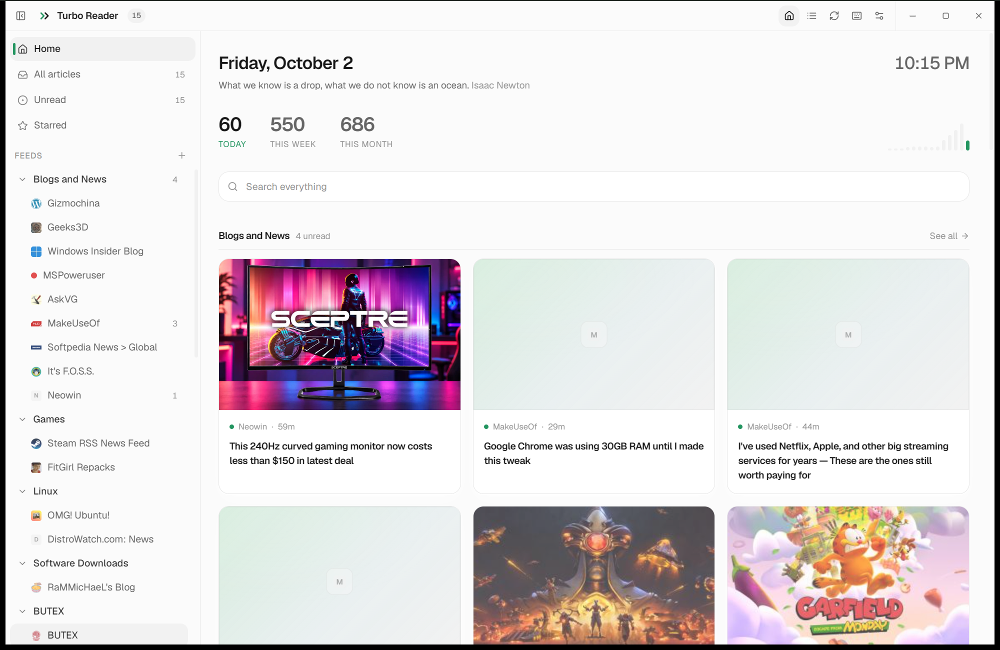
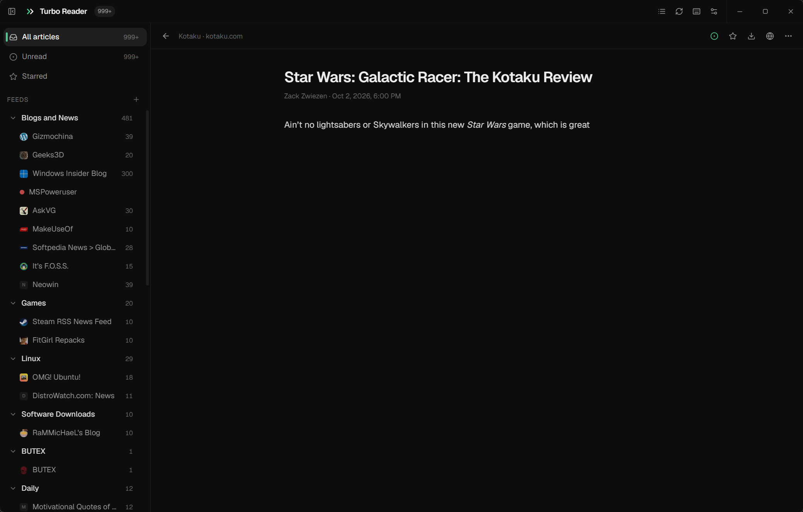
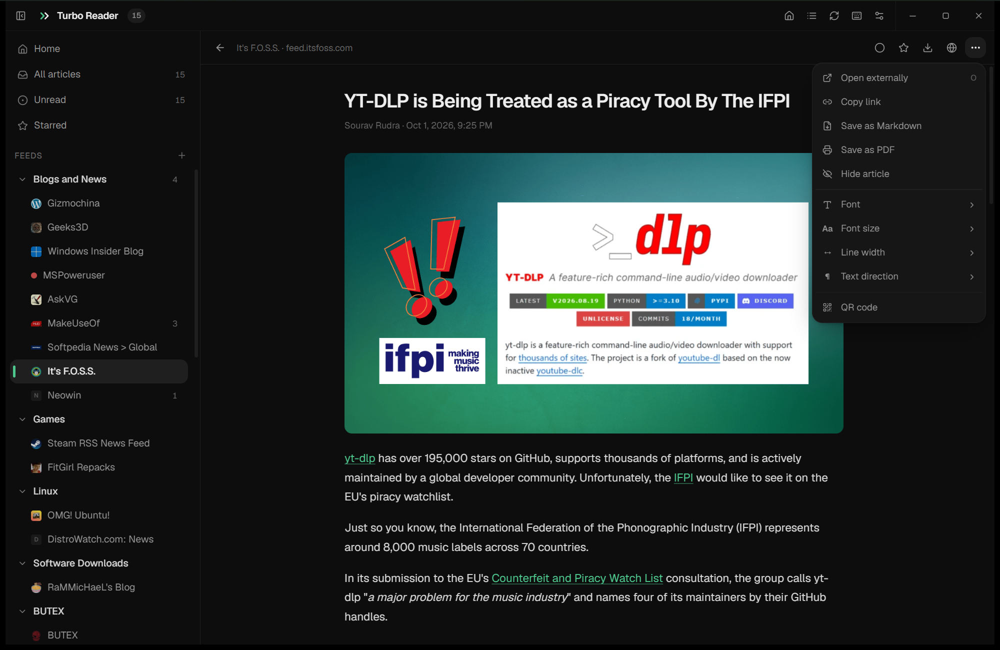
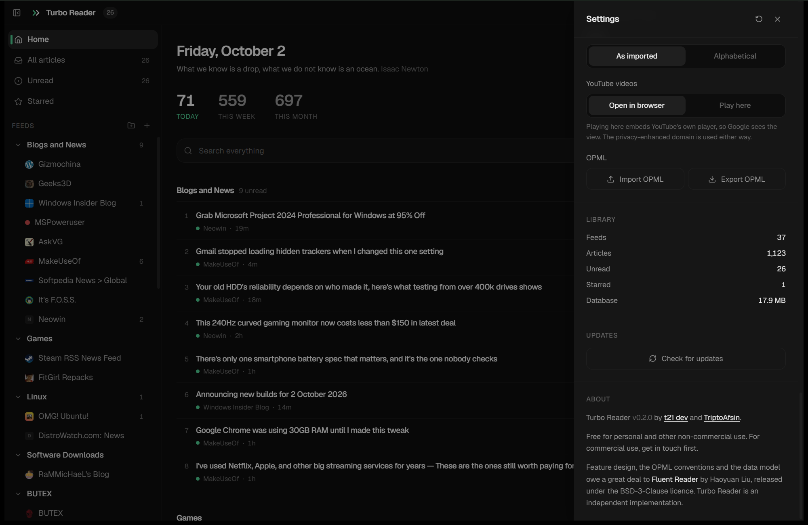
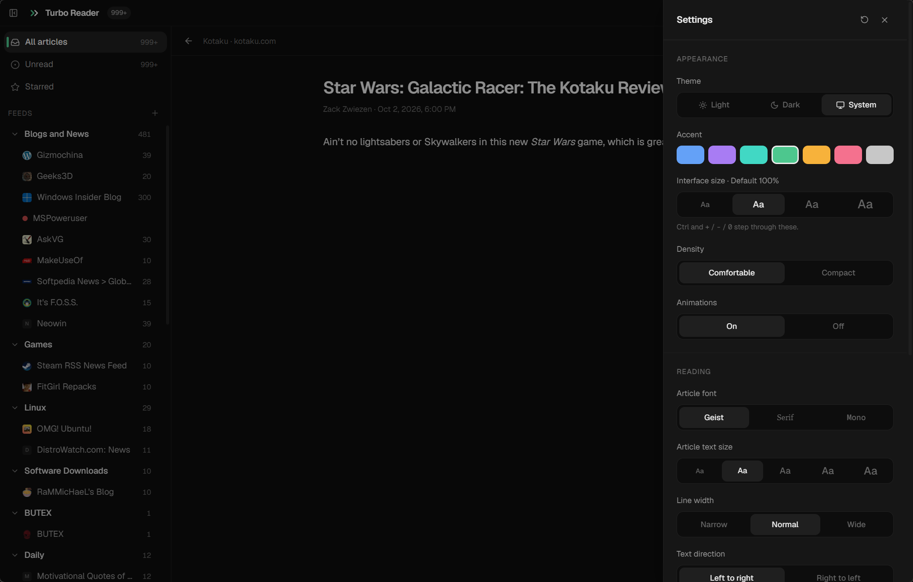

<div align="center">


# Turbo Reader

**A fast, modern RSS reader.** Rust core, React shell, built with Tauri 2.

<sub>Feeds are fetched, parsed and sanitised in Rust, outside the UI, so a malformed article cannot take the window down with it.</sub>

<br />

By **[t21 dev](https://github.com/t21dev)** and **[TriptoAfsin](https://github.com/TriptoAfsin)**

[](https://github.com/t21dev/turbo-reader/releases/latest)
[](https://github.com/t21dev/turbo-reader/actions)
[](LICENSE)

</div>

---

## Screenshots



| Dark | Light |
| --- | --- |
|  |  |

| The reader | Article actions |
| --- | --- |
|  |  |

| Settings | Shortcuts |
| --- | --- |
|  |  |

---

## Why this exists

I used [Fluent Reader](https://github.com/yang991178/fluent-reader) for years and it is a genuinely good app. But it has been unmaintained since 1.2.2, and over six weeks it bricked itself three separate times on my machine. Blank window, no error, blank again on every relaunch.

The cause turned out to be structural. Fluent Reader parses raw feed HTML inside the renderer. An article containing the text `<geolocation>` makes Blink instantiate an element with that name, and the renderer process is terminated outright. It is `STATUS_BREAKPOINT`, not an exception, so no `try/catch` and no React error boundary can contain it. Because articles are persisted, the crash repeated on every launch until I deleted the article database by hand. Three different web-dev feeds carried that story as the proposed `<geolocation>` HTML element made the rounds.

Turbo Reader is built so that cannot happen. The webview never receives feed HTML that has not been through an allowlist sanitiser in Rust first, and there is a test for exactly that case.

```rust
#[test]
fn geolocation_cannot_survive_sanitising() {
    let hostile = r#"<p>a <geolocation> b</p><script>alert(1)</script>"#;
    let out = sanitise(hostile, None);
    assert!(!out.contains("<geolocation"));
    assert!(!out.contains("<script"));
}
```

## Features

**Home**
- The date, a clock, and one optional line: a quote from a file you can edit,
  or the top story
- Counts for today, this week and this month, each one a filter, with a
  fourteen-day sparkline
- Search across everything, pinned feeds as a row, and a band per category
- Five layouts per category: cards, mosaic, magazine, compact and headlines,
  or auto, which decides from whether that category's feeds carry images
- Ranking with no API key and no network: freshness, unread, how often you
  open a feed, the feeds you pinned, and your own interest and mute lists.
  A line in slashes is a regular expression, anything else a substring
- Every card says why it is there

**Reading**
- Two views: a dense three-pane list, or a card grid with cover art
- Unread, starred and all filters, scoped per feed or per group
- Newest-first or oldest-first ordering
- Full-text search across every article, backed by SQLite FTS5
- Load full content for feeds that only publish a teaser
- Copy link, save as Markdown, save as PDF, QR code to a phone
- Hide an article, or mark all as read from 1, 3 or 7 days back
- Keyboard first, with a shortcut sheet on `?`
- Check for updates, from Settings

**Appearance**
- Light, dark, or follow the system
- Seven accent colours
- Comfortable and compact density
- Four interface sizes, on `Ctrl` `+` / `-` / `0`
- Article font, text size, line width and text direction
- Animations you can switch off

**Feeds**
- RSS 0.9x, 1.0 and 2.0, Atom, and JSON Feed, detected automatically
- Right-click a feed to rename, move, pin, set retention or delete it, and a
  folder to rename or delete it
- Automatic refresh on a timer, or manual only
- Sorted as imported or alphabetically
- YouTube feeds show the video, in the browser or inline
- OPML import and export, with folder nesting preserved both ways
- Conditional GET, so an unchanged feed costs one `304` and no parsing
- Per-feed retention limits
- Duplicate collapsing across feeds, keyed on the destination URL with tracking parameters stripped, so a story syndicated through three feeds shows up once

## Built on the community's wishlist

The feature set is not guesswork. These are the highest-voted open requests on Fluent Reader, and where each one stands here.

| Fluent Reader issue | Votes | Status |
| --- | --- | --- |
| [#246](https://github.com/yang991178/fluent-reader/issues/246), [#554](https://github.com/yang991178/fluent-reader/issues/554) Sort oldest to newest | 8, 4 | Shipped |
| [#144](https://github.com/yang991178/fluent-reader/issues/144), [#334](https://github.com/yang991178/fluent-reader/issues/334), [#533](https://github.com/yang991178/fluent-reader/issues/533) Hide duplicate articles | 8, 7, 3 | Shipped |
| [#334](https://github.com/yang991178/fluent-reader/issues/334) Post limit per feed | 7 | Shipped |
| [#347](https://github.com/yang991178/fluent-reader/issues/347), [#397](https://github.com/yang991178/fluent-reader/issues/397) UI scaling, larger fonts | 5, 5 | Shipped as density |
| [#335](https://github.com/yang991178/fluent-reader/issues/335) Theme customisation | 7 | Shipped as accents |
| [#256](https://github.com/yang991178/fluent-reader/issues/256) Identify articles by `guid` | 2 | Shipped |
| [#629](https://github.com/yang991178/fluent-reader/issues/629) FeedBurner returns 403 | 4 | Shipped, browser User-Agent |
| [#592](https://github.com/yang991178/fluent-reader/issues/592) Keyboard shortcuts | 2 | Shipped, with a shortcut sheet |
| [#539](https://github.com/yang991178/fluent-reader/issues/539) Sort groups and feeds alphabetically | 4 | Shipped |
| [#316](https://github.com/yang991178/fluent-reader/issues/316), [#100](https://github.com/yang991178/fluent-reader/issues/100) Tray and background notifications | 21, 16 | Planned |
| [#169](https://github.com/yang991178/fluent-reader/issues/169) Use the site's favicon | 9 | Shipped |
| [#190](https://github.com/yang991178/fluent-reader/issues/190) Nested folders | 4 | Planned |
| [#464](https://github.com/yang991178/fluent-reader/issues/464) HTTP Basic Auth feeds | 7 | Planned |
| [#211](https://github.com/yang991178/fluent-reader/issues/211), [#663](https://github.com/yang991178/fluent-reader/issues/663) YouTube content and previews | 9, 4 | Shipped |
| [#69](https://github.com/yang991178/fluent-reader/issues/69) Podcast feeds | 3 | Planned |
| [#4](https://github.com/yang991178/fluent-reader/issues/4), [#23](https://github.com/yang991178/fluent-reader/issues/23) Feedly and sync services | 87, 39 | Under consideration |

Sync services (Feedly, Fever, the Google Reader API, Miniflux, Nextcloud, TinyTinyRSS) are the most requested feature by a wide margin and also the largest body of work. They are out of scope for 0.1 rather than half-built.

## Architecture

```
src-tauri/src/
  feed.rs       fetch, parse, sanitise. The security boundary.
  readable.rs   full-content extraction, scored and sanitised
  markdown.rs   HTML to Markdown for the export
  db.rs         SQLite schema, FTS5 index, retention
  opml.rs       OPML import and export, folders preserved
  commands.rs   the Tauri command surface
src/
  lib/api.ts    typed client over those commands
  lib/theme.tsx light and dark modes, accent tokens
  components/   Sidebar, ArticleList, Reader, SettingsPanel
```

Two choices worth explaining.

**SQLite instead of an in-memory store.** Fluent Reader keeps its whole article store in lovefield-on-IndexedDB, which loads the entire database into the renderer at startup. That is why it slows down past roughly 100 MB. Here the data stays in SQLite, queries are paged, and search goes through FTS5.

**Bounded-concurrency fetching.** Refresh polls up to 12 feeds at once on a Tokio semaphore. Unbounded would hammer the connection pool. Serial would be slow.

## Development

```bash
npm install
npm run app          # dev, with hot reload
npm run app:build    # production bundle
cd src-tauri && cargo test
```

You need Rust (stable) and the [Tauri 2 prerequisites](https://v2.tauri.app/start/prerequisites/) for your platform.

## Attribution

Turbo Reader is an independent implementation and contains no Fluent Reader code.

It does owe Fluent Reader a great deal in feature design, the OPML conventions, the shape of the data model, and the thinking behind its filter and rules system. [Fluent Reader](https://github.com/yang991178/fluent-reader) is by Haoyuan Liu, released under the BSD-3-Clause licence. If you want a mature reader with sync-service support today, use it.

Built with [Tauri](https://tauri.app), [feed-rs](https://github.com/feed-rs/feed-rs), [ammonia](https://github.com/rust-ammonia/ammonia) and [rusqlite](https://github.com/rusqlite/rusqlite). Type is [Geist](https://vercel.com/font).

## Size and memory

Both apps loaded with the same 37 feeds and around a thousand articles.

| | Fluent Reader 1.2.2 | Turbo Reader 0.1.0 |
| --- | --- | --- |
| Windows installer | 95.4 MB | **3.2 MB** |
| Installed on disk | 349.0 MB | **8.0 MB** |
| Main binary | 212.5 MB | **8.0 MB** |
| Memory, running | 526 MB across 4 processes | **41 MB in 1 process** |

The installer figures are the published x64 releases. The rest was measured on
the same Windows machine with both apps open on the same library.

The gap is structural rather than clever. Electron ships a browser; Tauri uses
the one Windows, macOS and Linux already have. And the article store stays in
SQLite instead of being loaded into the renderer, which is what kept Fluent
Reader's memory climbing with the size of the library.

## What is coming

The [AI assistant](docs/ai-assistant-spec.md) is specified and not yet built:
bring your own key, OpenAI-shaped so Claude, Gemini, Kimi, DeepSeek, Groq,
OpenRouter and a local Ollama all work, with summaries, clustering, a
connection test and a token ledger.

The home page already ranks without it, on local scoring and your own interest
and mute lists. The assistant is meant to make that better, not to be the thing
that makes it work.

## Licence

Free for personal, educational and other non-commercial use. Commercial use
needs a separate licence, so [get in touch](https://github.com/t21dev).

Turbo Reader is by [t21 dev](https://github.com/t21dev) and
[TriptoAfsin](https://github.com/TriptoAfsin). See [LICENSE](LICENSE) for the
full terms.
