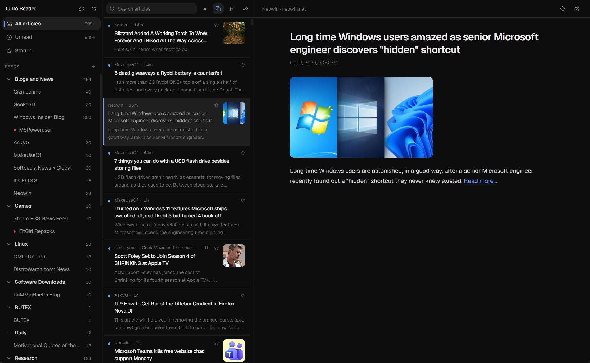

<div align="center">


# Turbo Reader

**A fast, modern RSS reader.** Rust core, React shell, built with Tauri 2.

<sub>Feeds are fetched, parsed and sanitised in Rust — outside the UI — so a malformed article can't take the window down with it.</sub>

</div>

---

## Screenshots

| Dark | Light |
| --- | --- |
|  |  |


---

## Why this exists

I used [Fluent Reader](https://github.com/yang991178/fluent-reader) for years and it is a genuinely good app. But it has been unmaintained since 1.2.2, and in a six-week stretch it bricked itself three separate times on my machine: a blank window, no error, blank again on every relaunch.

The cause turned out to be structural. Fluent Reader parses raw feed HTML inside the renderer. An article containing the text `<geolocation>` makes Blink instantiate an element with that name and **terminates the renderer process outright** — `STATUS_BREAKPOINT`, not an exception, so no `try/catch` and no React error boundary can contain it. Because articles are persisted, the crash repeated on every launch until the article database was deleted by hand. Three different web-dev feeds carried that story as the proposed `<geolocation>` HTML element made the rounds.

Turbo Reader is built so that class of failure cannot happen: **the webview never receives feed HTML that hasn't been through an allowlist sanitiser in Rust first.** There is a test for exactly that case.

```rust
#[test]
fn geolocation_cannot_survive_sanitising() {
    let hostile = r#"<p>a <geolocation> b</p><script>alert(1)</script>"#;
    let out = sanitise(hostile, None);
    assert!(!out.contains("<geolocation"));
    assert!(!out.contains("<script"));
}
```

## Features

**Reading**
- Three-pane layout — feeds, articles, reader
- Unread / starred / all filters, per-feed and per-group scoping
- Newest-first or oldest-first ordering
- Full-text search across every article, powered by SQLite FTS5
- Keyboard-first: `j` / `k` to move, `s` to star, `r` to refresh

**Feeds**
- RSS 0.9x / 1.0 / 2.0, Atom and JSON Feed, auto-detected
- OPML import and export, with folder nesting preserved both ways
- Conditional GET — an unchanged feed costs one `304` and no parsing
- Per-feed retention limits
- Cross-feed duplicate collapsing, keyed on the destination URL with tracking
  parameters stripped, so the same story syndicated through three feeds shows once

**Appearance**
- Light, dark, or follow the system
- Seven accent colours
- Comfortable and compact density
- Geist throughout

## Built on the community's wishlist

The feature set isn't guesswork. These are the highest-voted open requests on Fluent Reader, and where each one stands here:

| Fluent Reader issue | Votes | Status |
| --- | --- | --- |
| [#246](https://github.com/yang991178/fluent-reader/issues/246) / [#554](https://github.com/yang991178/fluent-reader/issues/554) Sort oldest → newest | 8 + 4 | **Shipped** |
| [#144](https://github.com/yang991178/fluent-reader/issues/144) / [#334](https://github.com/yang991178/fluent-reader/issues/334) / [#533](https://github.com/yang991178/fluent-reader/issues/533) Hide duplicate articles | 8 + 7 + 3 | **Shipped** |
| [#334](https://github.com/yang991178/fluent-reader/issues/334) Post limit per feed | 7 | **Shipped** |
| [#347](https://github.com/yang991178/fluent-reader/issues/347) / [#397](https://github.com/yang991178/fluent-reader/issues/397) UI scaling, larger fonts | 5 + 5 | **Shipped** (density) |
| [#335](https://github.com/yang991178/fluent-reader/issues/335) Theme customisation | 7 | **Shipped** (accents) |
| [#256](https://github.com/yang991178/fluent-reader/issues/256) Identify articles by `guid` | 2 | **Shipped** |
| [#629](https://github.com/yang991178/fluent-reader/issues/629) FeedBurner returns 403 | 4 | **Shipped** (browser UA) |
| [#592](https://github.com/yang991178/fluent-reader/issues/592) Keyboard shortcuts | 2 | **Partial** — fixed set today, custom bindings planned |
| [#539](https://github.com/yang991178/fluent-reader/issues/539) Sort groups and feeds alphabetically | 4 | Planned |
| [#316](https://github.com/yang991178/fluent-reader/issues/316) / [#100](https://github.com/yang991178/fluent-reader/issues/100) Tray + background notifications | 21 + 16 | Planned |
| [#169](https://github.com/yang991178/fluent-reader/issues/169) Use the site's favicon | 9 | Planned |
| [#190](https://github.com/yang991178/fluent-reader/issues/190) Nested folders | 4 | Planned |
| [#464](https://github.com/yang991178/fluent-reader/issues/464) HTTP Basic Auth feeds | 7 | Planned |
| [#211](https://github.com/yang991178/fluent-reader/issues/211) / [#663](https://github.com/yang991178/fluent-reader/issues/663) YouTube content and previews | 9 + 4 | Planned |
| [#69](https://github.com/yang991178/fluent-reader/issues/69) Podcast feeds | 3 | Planned |
| [#4](https://github.com/yang991178/fluent-reader/issues/4) / [#23](https://github.com/yang991178/fluent-reader/issues/23) Feedly and sync services | 87 + 39 | Under consideration — see below |

Sync services (Feedly, Fever, Google Reader API, Miniflux, Nextcloud, TinyTinyRSS) are the single most-requested feature and also the largest body of work. They are deliberately out of scope for 0.1 rather than half-built.

## Architecture

```
src-tauri/src/
  feed.rs       fetch → parse → sanitise.  The security boundary.
  db.rs         SQLite schema + FTS5 index + retention
  opml.rs       OPML import/export, folders preserved
  commands.rs   the Tauri command surface
src/
  lib/api.ts    typed client over those commands
  lib/theme.tsx light/dark + accent tokens
  components/   Sidebar · ArticleList · Reader · SettingsPanel
```

Two deliberate choices:

**SQLite, not an in-memory store.** Fluent Reader kept its whole article store in lovefield-on-IndexedDB, which loads the entire database into the renderer at startup — the reason it slowed to a crawl past ~100 MB. Here data stays in SQLite, queries are paged, and search goes through FTS5.

**Bounded-concurrency fetching.** Refresh polls up to 12 feeds at once on a Tokio semaphore. Unbounded would hammer the connection pool; serial would be slow.

## Development

```bash
npm install
npm run app          # dev, with hot reload
npm run app:build    # production bundle
cd src-tauri && cargo test
```

Requires Rust (stable) and the [Tauri 2 prerequisites](https://v2.tauri.app/start/prerequisites/) for your platform.

## Attribution

Turbo Reader is an independent implementation. It contains no Fluent Reader code.

It does owe Fluent Reader a great deal in feature design, the OPML conventions, the shape of the data model and the thinking behind its filter and rules system. **[Fluent Reader](https://github.com/yang991178/fluent-reader)** is by **Haoyuan Liu**, released under the BSD-3-Clause licence. If you want a mature, battle-tested reader with sync-service support today, use it.

Built with [Tauri](https://tauri.app), [feed-rs](https://github.com/feed-rs/feed-rs), [ammonia](https://github.com/rust-ammonia/ammonia) and [rusqlite](https://github.com/rusqlite/rusqlite). Type is [Geist](https://vercel.com/font).

## Licence

MIT — see [LICENSE](LICENSE).
